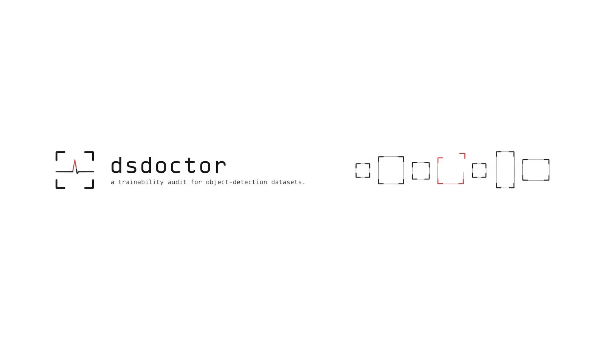
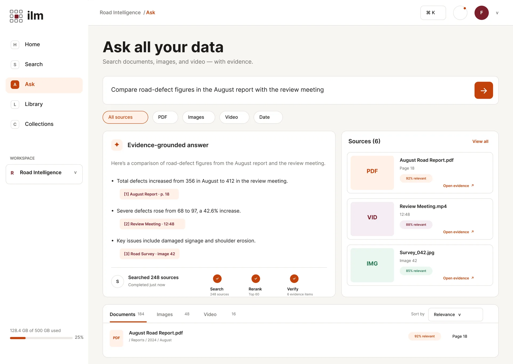
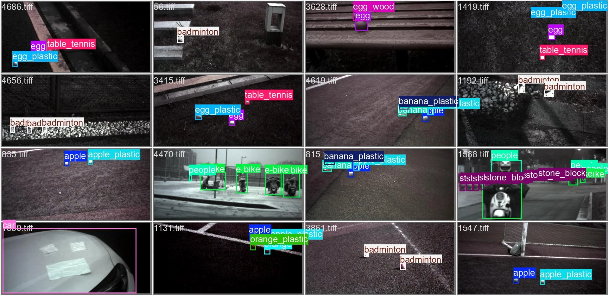
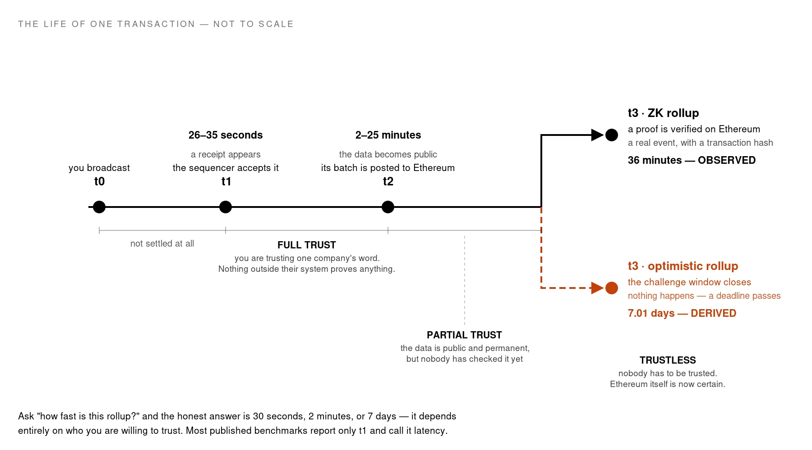
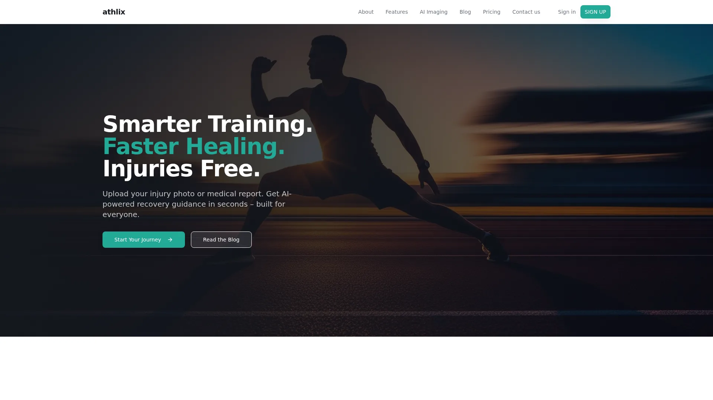
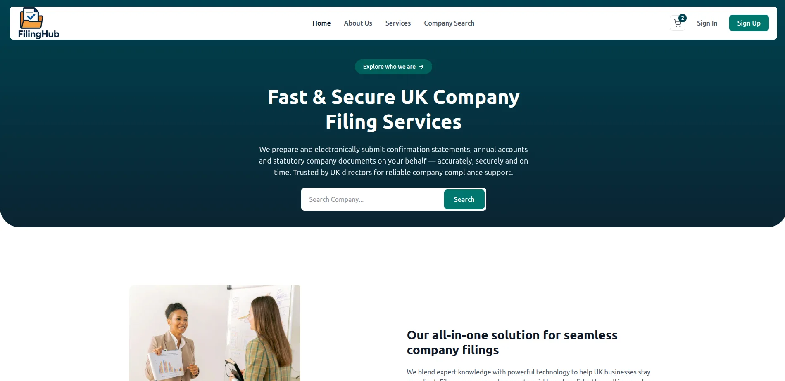
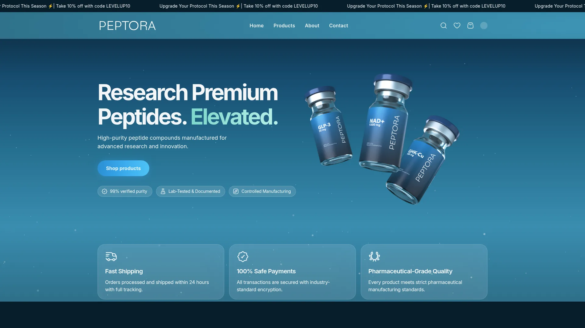
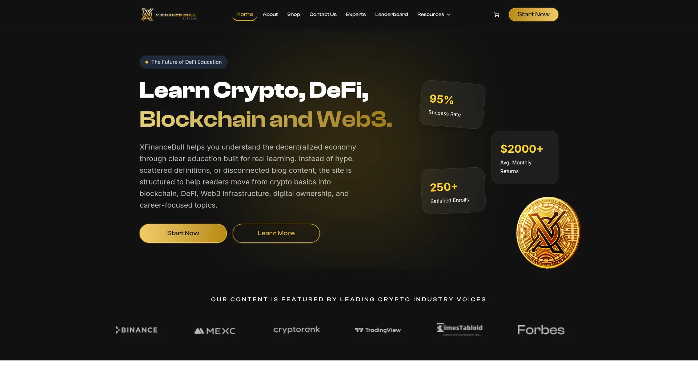
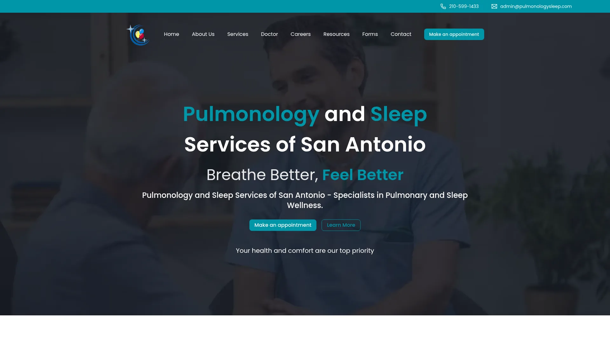

<div align="center">


<a href="https://furqan3.vercel.app/"></a>

<p>
<a href="https://furqan3.vercel.app/"></a>
<a href="https://www.linkedin.com/in/furqan-ktk/"></a>
<a href="mailto:fahmad.ktk@gmail.com"></a>
<a href="https://furqan3.vercel.app/resume"></a>
</p>


</div>

## 👋 About me

I'm a **Computer Engineer (NUST, Islamabad)** who builds complete products: the Next.js front end, the FastAPI back end, and the machine-learning models behind them.

- 🧠 **Machine Learning Engineer at [Vision Tech 360](https://furqan3.vercel.app/about):** RAG chatbots, real-time facial recognition across 50+ cameras, automated voice agents, and ML models served over FastAPI.
- 🛠️ **Freelance full-stack engineer:** e-commerce, healthcare, fintech and ed-tech sites that are live in production (see [shipped client work](#-shipped-client-work)).
- 🔬 **Research:** Ethereum L2 finality benchmarking for **Mitacs Globalink 2026**; hyperspectral object detection on Kaggle.
- 🏆 Six competition awards, including **two gold medals** and an **Indonesia Inventor Day special award**.

```yaml
llm_systems:      [RAG, hybrid retrieval, agentic workflows, local inference with vLLM]
computer_vision:  [object detection (YOLO, D-FINE, RT-DETR), face recognition, medical imaging]
voice:            [Whisper ASR, NLP, TTS, real-time dialogue]
web:              [Next.js, React, FastAPI, Node.js, WebSockets, Postgres, MongoDB, Redis]
ops:              [Docker, CI/CD, Nginx, PM2, DigitalOcean, Vercel]
```

## 🚀 Featured projects

<table>
<tr>
<td width="50%" valign="top">
<a href="https://furqan3.vercel.app/projects/dsdoctor"></a>

### [dsdoctor](https://github.com/Furqan3/dsdoctor)
**Is this detection dataset safe to train on?** Finds train/val leakage, zero-area boxes, unnormalised coordinates and starved classes before you waste a GPU-day, then returns a verdict and an ordered fix plan. Findings come from deterministic detectors, not an LLM. Ships with 218 offline tests.

`Python` `Object Detection` `LLM Agents` `vLLM`
</td>
<td width="50%" valign="top">
<a href="https://furqan3.vercel.app/projects/ilm"></a>

### [ilm](https://furqan3.vercel.app/projects/ilm)
**Ask all your data, and get the exact evidence.** A local multimodal knowledge engine over PDFs, slides, images, audio and video. Every answer cites the exact page, image or second of video it came from. Uses BM25, BGE-M3 and SigLIP 2 retrieval fused by rank, plus a multi-step query planner.

`FastAPI` `Next.js` `RAG` `SigLIP 2` `Whisper`
</td>
</tr>
<tr>
<td width="50%" valign="top">
<a href="https://furqan3.vercel.app/projects/hyperspectral-object-detection"></a>

### [Hyperspectral Object Detection 2026](https://furqan3.vercel.app/projects/hyperspectral-object-detection)
Detecting 18 classes in **16-band hyperspectral** night and street imagery on Kaggle, with a single model and no ensembles allowed. Adapted COCO-pretrained YOLO, RT-DETR, D-FINE, DINO and Co-DETR to 16 channels. D-FINE-S scored **0.710 mAP** on my own validation split and **0.658** on the public leaderboard.

`PyTorch` `D-FINE` `RT-DETR` `MMDetection`
</td>
<td width="50%" valign="top">
<a href="https://furqan3.vercel.app/projects/l2-finality-benchmark"></a>

### [Ethereum L2 Finality Benchmark](https://github.com/Furqan3/L2_benchmarking)
**Mitacs Globalink 2026** research. Measures when an L2 transaction is *really* final at three trust levels: sequencer receipt, batch posted to Ethereum, and proof or challenge window. **2,485 transactions** across 60 runs on zkSync and OP Stack, with an audit of every measurement.

`Python` `Ethereum` `zkSync` `Optimism`
</td>
</tr>
</table>

## 🌐 Shipped client work

| | Project | What I built | Stack |
|:-:|---|---|---|
|  | **[Athlix](https://www.athlix.fit/)** | SaaS that generates AI recovery and injury-prevention plans for athletes, with Stripe billing | Next.js · FastAPI · GPT API · Stripe |
|  | **[FilingHub](https://filinghub.co.uk/)** | Dual-portal app connecting UK businesses with accountants, with real-time messaging | Next.js · TypeScript · Socket.io · PostgreSQL |
|  | **[Peptora Labs](https://www.peptoralabs.com/)** | Headless e-commerce storefront with CMS-driven content and email flows | Next.js · Medusa.js · Storyblok · Klaviyo |
|  | **[X Finance Bull](https://xfinancebull.com/)** | Web3 and DeFi learning academy with courses, expert profiles and a leaderboard | Next.js · Storyblok · Supabase |
|  | **[Pulmonology & Sleep Services](https://www.pulmonologysleep.com/)** | Modern site for a board-certified medical practice in San Antonio | Next.js · Strapi · Supabase |

<details>
<summary><b>More projects</b> (ML, computer vision, blockchain)</summary>
<br/>

| Project | Summary | Stack |
|---|---|---|
| [Santander Transaction Prediction](https://github.com/Furqan3/santander-customer-transaction-prediction) | Kaggle binary classification on 200 anonymised features | LightGBM · XGBoost |
| [Multiclass CNN Classifier](https://github.com/Furqan3/ai_project) | Custom 6.3M-parameter CNN image classifier | TensorFlow · Keras |
| [Anomaly Detection System](https://github.com/Furqan3/Anomalies-detection) | Real-time network-security dashboard backed by an ML API | Flask · scikit-learn |
| [CBDC with FPGA](https://github.com/Furqan3/cbdc) | Central-bank digital currency on Hyperledger Fabric with FPGA crypto | Go · Hyperledger Fabric |
| [Histopathological Image Analysis](https://github.com/Furqan3/Histopathological-Images-Analysis) | U-Net segmentation of histopathology slides | TensorFlow · U-Net |
| [Braille Language Decoding](https://github.com/Furqan3/Braille-Language-Decoding) | Braille-to-English decoding with connected-component analysis | OpenCV |
| [Skin Lesion Classification](https://github.com/Furqan3/Skin-Lesion-Classification) | Melanoma detection with classical ML, 83% accuracy | OpenCV · scikit-learn |

All projects, with write-ups and screenshots, are on **[furqan3.vercel.app/projects](https://furqan3.vercel.app/projects)**.

</details>

## 💼 Experience

| Role | Company | When |
|---|---|---|
| **Machine Learning Engineer** | Vision Tech 360 · Islamabad | Jun 2024 – present |
| **Full-Stack & AI Engineer** | Freelance | Jan 2023 – present |
| Software Engineer Intern | IMAGE INC · Remote | Jun 2023 – Sep 2023 |
| IoT / Embedded Systems Intern | AIRLIFT Technologies · Islamabad | Feb 2022 – May 2022 |

## 🏆 Achievements

- 🥇 **1st Place, Gold Medal:** Fesmaro IT Business Competition (2025)
- 🥇 **1st Place, Gold Medal:** Tech & Trade Expo (2024)
- 🌟 **Special Award, Gold Medal and incubation offer:** Indonesia Inventor Day (2024)
- 🥈 **2nd Place, Silver Medal:** IdeaFest (2024)
- 🥉 **3rd Place, Bronze Medal:** Faculty of Engineering Most Outstanding Student (2025)
- 🚀 **Finalist:** Hackfest Build to Billion (2025)

## 🧰 Tech stack

<div align="center">

<br/>
<br/>
<br/>
<br/>


</div>

## 📊 GitHub activity

<div align="center">


</div>

---

<details>
<summary><b>📁 About this repository</b>: the source of my portfolio site</summary>
<br/>

This repo powers **[furqan3.vercel.app](https://furqan3.vercel.app/)**, which is built with Next.js 15, Tailwind CSS 4 and Framer Motion.

- **Fully static:** every page, all project pages and the resume PDF are prerendered at build time, with no CMS or runtime data fetching.
- **Content lives in code:** projects, experience, achievements and bio are in [`data/content.js`](data/content.js). Images are in `public/image/content/`, and the resume is in [`app/resume/data.js`](app/resume/data.js).
- **Also includes** an AI chat widget, a Spotify "now playing" card on the About page, and a downloadable PDF resume at `/api/resume`.

```bash
pnpm install
pnpm dev        # http://localhost:3000
pnpm build      # static production build
```

To add a project, append an entry to `projects` in `data/content.js`, put its images in `public/image/content/projects/<slug>/`, and rebuild.

Based on the open-source [Alvalens portfolio template](https://github.com/Alvalens/Alvalens-porto-2-nextJs) · GPL-3.0.

</details>

<div align="center">

</div>
